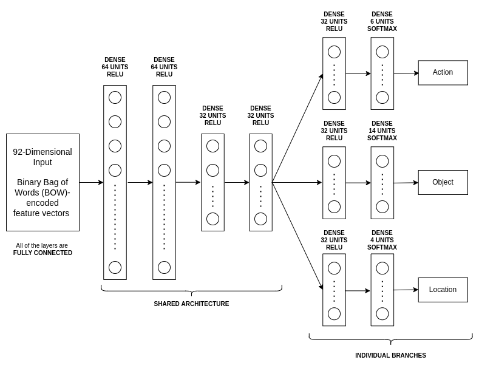

# Saarthi.AI Assignment Submission

## Details
- **Name** - Vishesh Mittal
- **Email** - mittalvishesh021@gmail.com

## Goal
In the given task, the **goal is that with given text you need to extract all the labels** i.e., action that needs to be taken, action to be taken on which object, and location where that object is present.

## Steps to Run
- Open the `config.yaml` file.
- Set the `dataset_path` to the path of the folder where the `train_data.csv` and `valid_data.csv` files are present. Note that the path needs to be of the folder containing these files, not of the individual files.
- Set the `log_path` to the path of the folder where you want the log files to be stored. The `train.py` will automatically create a folder as per the path provided, and will store the log files inside the created folder.
- Set the `save_path` to the path of the folder where you want the encoder, vectorizer and model files to be stored. Once again, the `train.py` will automatically create a folder as per the path provided, and will store the files inside the created folder.
- For now, ignore the `test_path`. Let it be any random value. More on this has been discussed in the section entitled **Performing Evaluation**.
- After that, the desired number of epochs and batch-size can be set via the `epochs` and `batch_size` properties respectively. Some good consistent values have been already set as default.
- The next step is to train the model. Navigate into the directory that contains the `train.py` file and run the command `python3 train.py --config <path_of_config_file>` or `python train.py --config <path_of_config_file>`. Note that the path needs to be of the folder, not of the config file.
- Once the `train.py` file has been run, a model will be trained on the `train_data.csv` file, followed by predictions on both `train_data.csv` and `valid_data.csv` files. Also, the relevant pre-processors and the model will be stored, and the suitable log files will be created.
- The last step is to run the `eval.py` file to perform evaluation for a given test file (*i.e., to determine the F1-Score*), or to predict the action, object and location for a given string. More on this has been discussed in the section enititled **Performing Evaluation**.

## Example
- Here's an example of my current file structure, and how to train the model, and perform inference with the help of the trained model.
- "/home/elemento/Downloads/Saarthi/" (**Root Path**)
  - Assignment
    - Logs
    - Saved
    - `config.yaml`
    - `eval.py`
    - `Exploration.ipynb`
    - `train.py`
    - `Training.ipynb`
  - task_data
    - wavs
    - `train_data.csv`
    - `valid_data.csv`
  - `README.md`
- All the paths including the `dataset_path`, `log_path`, and `save_path` have been set in accordance with the above file structure.
- The only difference is that the `test_path` has been set to indicate the `valid_data.csv` file currently, and can be changed to indicate the test file.

## Exploration and Motivation for the Current Approach
- The basic exploration performed for this dataset can be found in `Exploration.ipynb`. As mentioned in the question statement, the transcripts of the audio files can be considered to be as given, and hence, the audio files didn't perform any role in the entire **data analysis** and/or **data modeling**.
- Although the **action, object and location** are given as textual form in the dataset, a simple analysis conducted for finding the number of unique values for each of the 3 entities gave the numbers as follows:
  - **Number of Unique Actions**: 6
  - **Number of Unique Objects**: 14
  - **Number of Unique Locations**: 4
- The same results hold true for both `train_data.csv` and `valid_data.csv`.
- Therefore, treating them as **categorical features** instead of **textual features** not only reduced the computation required for analysis, but also simplified the analysis to a great extent. **One-Hot Encoding** is used to transform each of these into categorical features, which later serve as the labels for the model.
- A similar analysis of finding the unique words in all of the transcripts found out that there are only **124 unique words** in all of the transcripts, once again, for both `train_data.csv` and `valid_data.csv`.
- **Count Vectorizer** is used to transform the transcripts into **Binary Bag-of-Words (BoW)** based representation, each of which is 92-dimensional representation. This is because the count of 124 considers words like "English" and "English." different, i.e., it takes punctuation into account, whereas the sklearn's implementation Count Vectorizer removes all the punctuation. 
- Followed by the pre-processing, a neural network is trained on the dataset of **92-dimensional vectors** to predict **24-dimensional labels** using a **custom loss function (based on categorical cross-entropy)**, a **custom metric (based on accuracy)** and **ADAM optimizer**. Details of the dataset organization, the custom functions and the model structure can be found in the following sections.

## Dataset Organization
- The 92-dimensional Binary BoW based representations of the transcripts form the input for the neural network model.
- For each sample, the 
  - **Action** is encoded into a **6-dimensional** one-hot encoded representation
  - **Object** is encoded into a **14-dimensional** one-hot encoded representation
  - **Location** is encoded into a **4-dimensional** one-hot encoded representation 
- These one-hot encoded representations are concatenated into a single 24-dimensional representation for each sample, which is used as the corresponding label for each sample. 
- It is the **one-hot encoded** nature of the individual parts of the 24-dimensional label that mandated the need for a custom metric and a custom loss function, as discussed in the next section.

## Custom Loss Function & Custom Metric
- The custom loss function is based on Tensorflow's implementation of [Categorical Cross-Entropy](https://www.tensorflow.org/api_docs/python/tf/keras/metrics/categorical_crossentropy), and can be found as `MyLoss` in the `train.py` file. 
- It splits the 24-dimensional true and predicted labels into 6, 14 and 4 dimensional true and predicted labels, for action, object and location respectively. It calculates the **categorical cross-entropy** for each of the 3 different entities individually, and simply sums them up to return the final loss. 
- Since the task of predicting the action, object and location simultaneously from the transcripts, has been treated as an aggregate of 3 multi-class classification tasks, hence, this custom loss function is required to train the model.
- Just like the loss function is custom-defined, similarly, the metrics are custom-defined as well. They can be found as `MyAcc` and `MyF1Score` in the `train.py` file.
- Once again, they split the 24-dimensional true and predicted labels. As for `MyAcc`, a sample is classified as accurate only when all the 3 entities, action, object and location are predicted correctly for the particular sample. 
- And as for `MyF1Score`, it is based on Scikit-Learn's implementation of [F1-Score](https://scikit-learn.org/stable/modules/generated/sklearn.metrics.f1_score.html). It calculates the F1-Score individually for all the 3 entities, and simply averages them to give the final F1-Score. 
- The model has been defined in accordance with these custom implementations of **Loss** and **Metrics**, as discussed in the next section.

## Model Structure
- The model is a **custom multi-layer perceptron (MLP)**, with some shared architecture for the 3 entities, and 3 different branches, one for each of the 3 entities.
- The **shared architecture** composes of **4 dense layers** each having **ReLU** activation function. Each of the **individual branches** composes of **2 more dense layers**, first having 32 units with **ReLU** activation function, and second having **Softmax** activation function with the appropriate number of units as per the entity.
- All the softmax outputs are concatenated to give a single 24-dimensional prediction vector for each of the input.
- The rest of the minor intricacies (*if any*) can be found in `create_model` inside the `train.py` file.

<figure>

<figcaption align = "center"><b>Fig.1 - Model Architecture</b></figcaption>
</figure>

## Performing Evaluation
- There are 2 different ways in which the `eval.py` script can be used for evaluations:
  - To perform evaluation on a test file, i.e., to give the F1-Score for a test file
  - To predict the action, object and location for a given string (*a single sample*)
- Based on the manner that you want `eval.py` to work, steps to run it are different. They are described below.

**Test File (Output F1-Score)**
- Open the `config.yaml` file. Set the `test_path` to the path of the test file `test.csv`. Note that the path needs to be of the specific file, not of the folder. **This file hasn't been used for training purposes**.
- After that, run the command `python3 eval.py --file <path_of_config_file>` or `python eval.py --file <path_of_config_file>`. Note that the path needs to be of the folder containing the config file, not of the config file itself.

**Given String (Single Sample)**
- The `test_path` in the `config.yaml` file is not used in this case, so, it can be safely ignored.
- After that, run the command `python3 eval.py --text <path_of_config_file> <string_in_quotes>` or `python eval.py --text <path_of_config_file> <string_in_quotes>`. Note that the path needs to be of the folder containing the config file, not of the config file itself.

## Final Output Score
- The trained model gives the **final loss (categorical cross-entropy)** in order of **10^-6**, with an **accuracy** of **100%** on both the training and validation sets.

## Multi-GPU Training
- I don't have a GPU on my local system, hence, I never got the opportunity to work with a local GPU.
- Till now, all the experience that I have with GPU is restricted to **Kaggle and Colab**, and on both of them, working with **hierarchically-arranged** Python projects is something that I have never done, and I am not sure, if it's even possible.
- Hence, this code doesn't have any sort of support for multi-GPU training. However, I would love to gain some experience with training models on local GPU(s) provided the opportunity, and I am looking forward to it!
